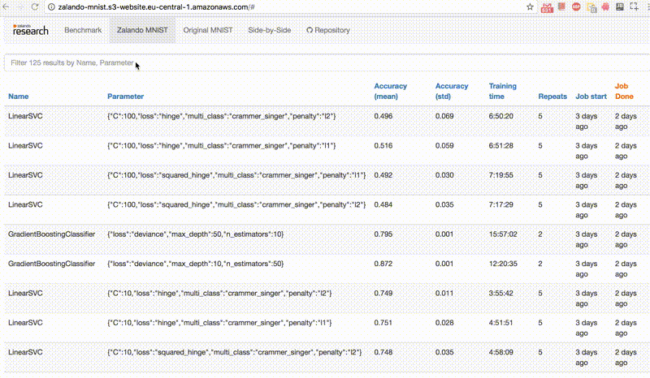
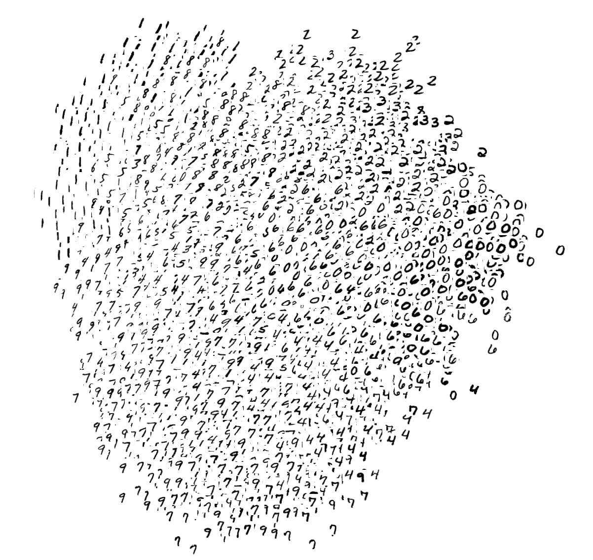
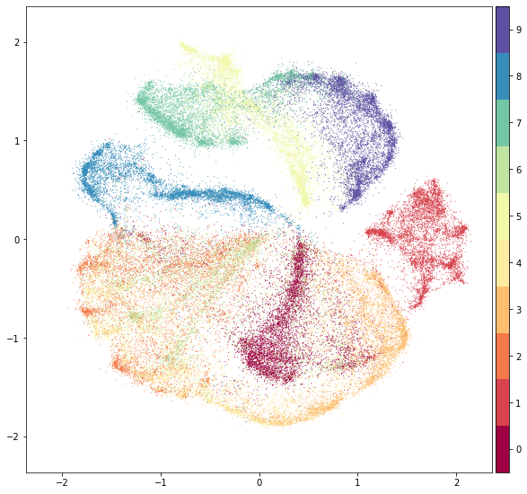
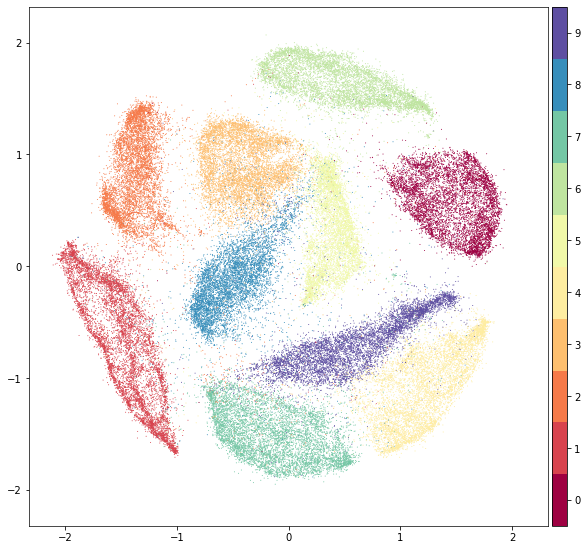

# Fashion


Here's an example of how the data looks (*each class takes three-rows*):


## Get the Data

[Many ML libraries](#loading-data-with-other-machine-learning-libraries) already include Fashion data/API, give it a try!

You can use direct links to download the dataset. The data is stored in the **same** format as the original [MNIST data](http://yann.lecun.com/exdb/mnist/).

| Name  | Content | Examples | Size | Link | MD5 Checksum|
| --- | --- |--- | --- |--- |--- |
| `train-images-idx3-ubyte.gz`  | training set images  | 60,000|26 MBytes | [Download](http://fashion-mnist.s3-website.eu-central-1.amazonaws.com/train-images-idx3-ubyte.gz)|`8d4fb7e6c68d591d4c3dfef9ec88bf0d`|
| `train-labels-idx1-ubyte.gz`  | training set labels  |60,000|29 KBytes | [Download](http://fashion-mnist.s3-website.eu-central-1.amazonaws.com/train-labels-idx1-ubyte.gz)|`25c81989df183df01b3e8a0aad5dffbe`|
| `t10k-images-idx3-ubyte.gz`  | test set images  | 10,000|4.3 MBytes | [Download](http://fashion-mnist.s3-website.eu-central-1.amazonaws.com/t10k-images-idx3-ubyte.gz)|`bef4ecab320f06d8554ea6380940ec79`|
| `t10k-labels-idx1-ubyte.gz`  | test set labels  | 10,000| 5.1 KBytes | [Download](http://fashion-mnist.s3-website.eu-central-1.amazonaws.com/t10k-labels-idx1-ubyte.gz)|`bb300cfdad3c16e7a12a480ee83cd310`|

Alternatively, you can clone this GitHub repository; the dataset appears under `data/fashion`. This repo also contains some scripts for benchmark and visualization.
   
```bash
git clone git@github.com:AdarshSenSingh/fashion.git
```

### Labels
Each training and test example is assigned to one of the following labels:

| Label | Description |
| --- | --- |
| 0 | T-shirt/top |
| 1 | Trouser |
| 2 | Pullover |
| 3 | Dress |
| 4 | Coat |
| 5 | Sandal |
| 6 | Shirt |
| 7 | Sneaker |
| 8 | Bag |
| 9 | Ankle boot |

## Usage

### Loading data with Python (requires [NumPy](http://www.numpy.org/))

Use `utils/mnist_reader` in this repo:
```python
import mnist_reader
X_train, y_train = mnist_reader.load_mnist('data/fashion', kind='train')
X_test, y_test = mnist_reader.load_mnist('data/fashion', kind='t10k')
```

### Loading data with Tensorflow
Make sure you have [downloaded the data](#get-the-data) and placed it in `data/fashion`. Otherwise, *Tensorflow will download and use the original MNIST.*

```python
from tensorflow.examples.tutorials.mnist import input_data
data = input_data.read_data_sets('data/fashion')

data.train.next_batch(BATCH_SIZE)
```

Note, Tensorflow supports passing in a source url to the `read_data_sets`. You may use: 
```python
data = input_data.read_data_sets('data/fashion', source_url='http://fashion-mnist.s3-website.eu-central-1.amazonaws.com/')
```

Also, an official Tensorflow tutorial of using `tf.keras`, a high-level API to train Fashion [can be found here](https://www.tensorflow.org/tutorials/keras/classification).


## Benchmark
We built an automatic benchmarking system based on `scikit-learn` that covers 129 classifiers (but no deep learning) with different parameters. [Find the results here](http://fashion-mnist.s3-website.eu-central-1.amazonaws.com/).



You can reproduce the results by running `benchmark/runner.py`. We recommend building and deploying [this Dockerfile](Dockerfile). 

## Visualization

### t-SNE on Fashion (left) and original MNIST (right) 


### PCA on Fashion (left) and original MNIST (right) 


### [UMAP](https://github.com/lmcinnes/umap) on Fashion (left) and original MNIST (right) 


### [PyMDE](https://github.com/cvxgrp/pymde) on Fashion (left) and original MNIST (right) 



